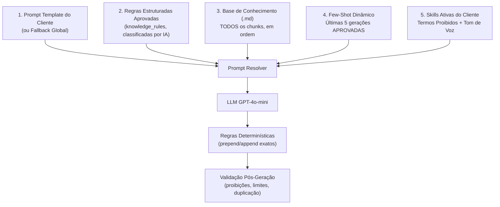

# AGENTS.md — Guia de Arquitetura e Contexto do Projeto para IAs

> Este documento descreve a arquitetura, regras de negócio, estrutura de dados e fluxos operacionais deste sistema para guiar qualquer agente de IA ou desenvolvedor que trabalhe neste repositório.

---

## 1. Visão Geral do Projeto

O **CRIA** — agente de criação e enriquecimento de anúncios do ecossistema AnyTools (Marca Seleta) — é uma plataforma multi-cliente orientada a agentes de IA com **aprendizado evolutivo contínuo**. O sistema transforma dados brutos de produtos (título, descrição, características) vindos do ERP/Marketplace (**AnyMarket**) em anúncios otimizados para SEO e alta conversão.

> Nomenclatura: sempre "CRIA" em caixa alta como nome do produto; em texto corrido, "o CRIA". Evitar "CRIA IA".

### O Problema Resolvido:
Superar a limitação de geradores estáticos simples. Cada cliente possui suas próprias regras de negócio, tom de voz, lista de palavras proibidas, tokens da AnyMarket e manuais da marca. O sistema aprende a cada clique de **Aprovação ✅**, **Rejeição ❌** ou **Edição ✏️** feito pela equipe de operadores.

---

## 2. Stack Tecnológica

| Camada | Tecnologia | Função |
|---|---|---|
| **Frontend** | React 18 + Vite 5 + TailwindCSS + Zustand | Interface responsiva e reativa (Modo Escuro / Glassmorphism) |
| **Backend API** | Node.js (ESM) + Express 5 | API RESTful com rotas autenticadas |
| **Infraestrutura** | Firebase (Cloud Firestore + Auth) | Autenticação de operadores e banco de dados NoSQL |
| **Modelos de IA** | OpenAI API | `gpt-4o-mini` (geração), `gpt-4o` (Meta-Prompting), `text-embedding-3-small` (RAG) |
| **Integração** | n8n Webhooks + AnyMarket API | Busca de produtos e envio de atualizações (PATCH) |

---

## 3. Arquitetura de Aprendizado Evolutivo (4 Camadas)

Toda chamada de geração de texto passa pelo [promptResolver.js](file:///c:/Users/igor.costa/OneDrive%20-%20DB1%20Group/Documentos/MELHORIA%20DE%20DESCRICAO/MELHORIA%20DE%20DESCRICAO/server/services/promptResolver.js), que compõe o prompt final unindo 4 camadas dinâmicas:



1. **Prompt Base:** Template do cliente gravado no Firestore (`clients/{clientId}/prompts/{type}`) ou fallback global.
2. **Regras Estruturadas:** No upload do `.md`, o [ruleExtractor.js](server/services/ruleExtractor.js) usa a OpenAI para classificar o documento em regras tipadas (`fixed_text`, `prohibition`, `mandatory_instruction`, `formatting`, `category_template`). As aprovadas entram no prompt como texto e alimentam as camadas determinística e de validação.
3. **Base de Conhecimento:** Injeta **todos** os chunks `.md` do cliente, em ordem de `chunkIndex`.
4. **Few-Shot Dinâmico:** Injeta as 5 gerações aprovadas/editadas **mais recentes** do cliente (`orderBy('createdAt','desc')` — exige índice composto no Firestore; há fallback sem ordenação se o índice não existir).
5. **Skills Ativas:** Injeta regras de habilidades ativas (ex: palavras proibidas, tom de voz, formatador HTML).

### Arquitetura híbrida: o que é semântico e o que é determinístico

Nem toda regra vai para o prompt. A divisão importa:

| Camada | Onde roda | Garantia |
|---|---|---|
| **Semântica** | Prompt (regras como texto + chunks + few-shot) | Melhor esforço do LLM |
| **Determinística** | `applyDeterministicRules` em [outputValidator.js](server/services/outputValidator.js) | Textos com `prepend_exactly`/`append_exactly` são inseridos por código — não dependem do LLM |
| **Validação** | `validateOutput` no mesmo arquivo | Detecta termo proibido, cerca markdown residual, excesso de caracteres e bloco fixo duplicado |

> ⚠️ **Não trocar a camada 3 por busca por similaridade (top-K / cosseno).** Um documento de diretrizes de marca é integralmente relevante para todos os produtos; recortar por relevância descartava partes obrigatórias do contexto e o bloco institucional deixava de ser aplicado. `findTopKSimilarChunks` e `cosineSimilarity` existem em [ragService.js](server/services/ragService.js) mas estão deliberadamente fora do caminho de geração.

O resultado de `validateOutput` volta na resposta de `POST /api/generate` (`titleValidation` / `descValidation`) e é exibido no card do produto no ReviewPanel — é assim que o CRIA avisa o operador do que precisa de atenção em vez de entregar o texto em silêncio.

---

## 4. Estrutura de Coleções no Firestore

```
operators/ {uid}
  ├── name: string
  ├── email: string
  └── role: "admin" | "editor"

clients/ {clientId}
  ├── name: string
  ├── slug: string
  ├── anymarket_token: string
  ├── isActive: boolean
  ├── settings: { model: string, temperature: number }
  │
  ├── prompts/ (sub-coleção)
  │     ├── titulo/ { content: string, version: number, isActive: boolean }
  │     └── descricao/ { content: string, version: number, isActive: boolean }
  │
  ├── skills/ (sub-coleção)
  │     └── {skillId}/ { name: string, promptInjection: string, isActive: boolean, config: object }
  │
  ├── knowledge_docs/ (sub-coleção)
  │     └── {docId}/ { filename: string, charCount: number, chunkCount: number }
  │
  └── knowledge_chunks/ (sub-coleção)
        └── {chunkId}/ { docId: string, content: string, embedding: Array<number> }

generations/ {generationId}
  ├── clientId: string
  ├── operatorId: string
  ├── productId: string
  ├── generationType: "titulo" | "descricao"
  ├── generatedText: string
  ├── feedbackStatus: "pending" | "approved" | "rejected" | "edited"
  ├── editedText: string | null
  ├── promptVersion: number
  ├── ragChunksUsed: string[]
  └── createdAt: Timestamp
```

---

## 5. Estrutura do Código-Fonte

```
MELHORIA DE DESCRICAO/
├── .agents/
│   └── skills/
│       └── client_onboarding/SKILL.md  # Skill local de automação de onboarding
├── server/
│   ├── index.js                     # Ponto de entrada do Express
│   ├── middleware/
│   │   └── auth.js                  # Middleware JWT do Firebase (requireAuth/requireAdmin)
│   ├── routes/
│   │   ├── clients.js               # CRUD de clientes no Firestore
│   │   ├── generate.js              # Pipeline de geração de textos com IA
│   │   ├── prompts.js               # Leitura e salvamento de prompts por cliente
│   │   ├── feedback.js              # Registro de feedbacks (aprovar, rejeitar, editar)
│   │   ├── knowledge.js             # Upload e gestão de arquivos .md do RAG
│   │   ├── skills.js                # Gestão de habilidades ativas do cliente
│   │   ├── insights.js              # Métricas e Meta-Prompting com GPT-4o
│   │   └── anymarket.js             # Proxy PATCH para o AnyMarket via n8n
│   ├── services/
│   │   ├── firebaseAdmin.js         # Inicialização do Firebase Admin SDK
│   │   ├── llmService.js            # Abstração unificada da OpenAI API
│   │   ├── promptResolver.js        # Montagem do System Prompt (Base + RAG + FewShot + Skills)
│   │   └── ragService.js            # Chunking de Markdown e embeddings semânticos
│   └── scripts/
│       └── createOperator.js        # Utilitário para cadastrar/atualizar operadores
├── src/
│   ├── App.jsx                      # Roteamento e observador de sessão Firebase Auth
│   ├── components/
│   │   ├── LoginPage.jsx            # Tela de Login com email e senha
│   │   ├── ClientSelector.jsx       # Seletor de Cliente com filtro
│   │   ├── Header.jsx               # Navegação por abas e contexto do operador
│   │   ├── ProductTable.jsx         # Carregamento e tabela de produtos
│   │   ├── ReviewPanel.jsx          # Painel de revisão com botões de feedback
│   │   ├── KnowledgeManager.jsx     # Gestão da Base RAG (.md) por arraste
│   │   ├── ClientSkillsManager.jsx  # Gestão de Skills (termos proibidos, tom de voz)
│   │   ├── ClientDashboard.jsx      # Insights de aprendizado e Meta-Prompting
│   │   └── ConfigModal.jsx          # Configurações do cliente e token AnyMarket
│   ├── services/
│   │   ├── firebaseClient.js        # Inicialização do Firebase Web SDK
│   │   ├── aiService.js             # Chamadas HTTP para a API de geração e feedback
│   │   └── anymarketService.js      # Envio de atualizações para o AnyMarket
│   └── store/
│       └── useStore.js              # Estado global do Zustand (auth, client, products)
├── .env.example                     # Template de variáveis de ambiente
├── package.json                     # Dependências do projeto
└── AGENTS.md                        # Este documento de referência para IAs
```

---

## 6. Rotas da API RESTful (`server/`)

Todas as rotas `/api/*` (exceto `/health`) exigem o header `Authorization: Bearer <firebase_id_token>`.

* `POST /api/generate` — Gera títulos/descrições aplicando regras estruturadas, base de conhecimento, Few-Shot e Skills. Devolve também `titleValidation`/`descValidation` (violações detectadas) e `titleRulesApplied`/`descRulesApplied` (regras determinísticas aplicadas).
* `PATCH /api/feedback/:generationId` — Grava o feedback do operador (`approved`, `rejected`, `edited`).
* `POST /api/feedback/batch` — Aplica feedback em lote para múltiplos produtos.
* `GET /api/clients` — Lista todos os clientes ativos.
* `POST /api/clients` — Cadastra novo cliente (apenas `admin`).
* `GET /api/prompts/:clientId` — Retorna os prompts ativos do cliente.
* `PUT /api/prompts/:clientId` — Atualiza prompts criando uma nova versão (apenas `admin`).
* `POST /api/knowledge/:clientId` — Upload e vetorização RAG de arquivo `.md`.
* `GET /api/knowledge/:clientId` — Lista documentos RAG do cliente.
* `DELETE /api/knowledge/:clientId/:docId` — Exclui documento RAG e seus chunks.
* `GET /api/skills/:clientId` — Lista skills ativas e disponíveis do cliente.
* `PUT /api/skills/:clientId/:skillId` — Configura/ativa skill para o cliente (apenas `admin`).
* `GET /api/insights/:clientId` — Retorna estatísticas de aprovação, n-gramas e recomendações.
* `POST /api/insights/:clientId/meta-prompt` — Executa o GPT-4o para sugerir prompt otimizado.

---

## 7. Como Executar o Projeto

```bash
# 1. Instalar dependências
npm install

# 2. Configurar variáveis no .env (copiar de .env.example)
cp .env.example .env

# 3. Rodar aplicação em modo de desenvolvimento (Frontend + Backend)
npm run dev

# 4. Cadastrar primeiro operador administrador
node server/scripts/createOperator.js "seu.email@empresa.com" "senha123" "Seu Nome"
```

---

## 8. Diretrizes para Futuras Alterações (Regras de Ouro)

1. **Isolamento de Dados:** Toda nova funcionalidade DEVE receber `clientId` e filtrar dados estritamente dentro daquele contexto no Firestore.
2. **Preservação de APIs:** Não altere assinaturas de rotas sem atualizar as chamadas no `aiService.js` ou `anymarketService.js`.
3. **Persistência de Feedbacks:** Toda alteração no texto feita pelo operador deve gerar uma gravação de feedback (`edited`) para continuar alimentando a malha de aprendizado do modelo.
4. **Verificação de Build:** Sempre execute `npx vite build` para garantir zero regressões na compilação.
