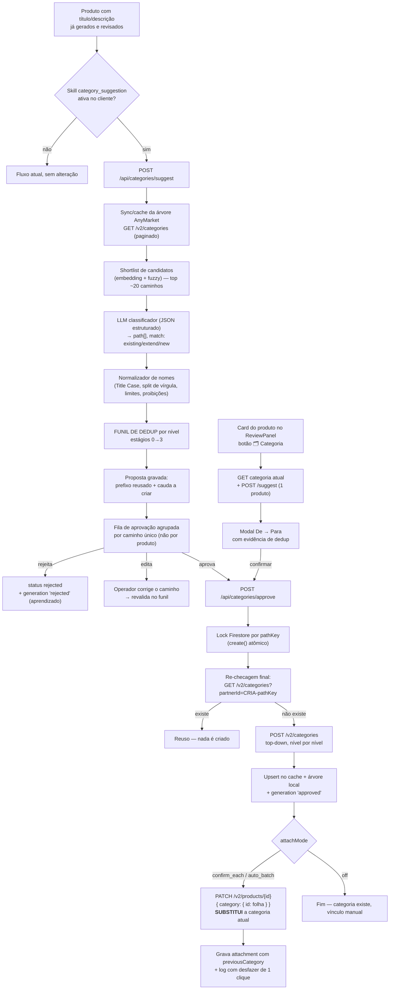

# Especificação — Criação Assistida de Categorias no AnyMarket (CRIA)

> Funcionalidade **OPCIONAL** do CRIA. Sugere a categoria (hierárquica, padrão marketplace) a partir do título
> e da descrição já gerados, deduplica contra a árvore real do AnyMarket, exige **aprovação humana** e só então
> cria a categoria via API. Pelo botão 🗂️ Categoria no card do produto, o operador vê o "de → para" e, ao confirmar,
> a categoria atual do produto é substituída — com desfazer de 1 clique. Nada no fluxo atual de título/descrição muda.

Status: **Fase 1 implementada** (sync/cache da árvore, só leitura) — Fases 2 a 5 pendentes, ver §14.

> **Continuação deste roadmap:** `docs/ESPECIFICACAO_CANAIS_E_ATRIBUTOS.md` — vínculo de categoria por canal (de-para)
> e atributos obrigatórios por marketplace. É o passo que falta para o produto realmente **publicar**: categoria criada
> aqui nasce sem de-para de canal, e sem ele o marketplace recusa o anúncio.
Autor: arquitetura assistida — decisões e pendências na seção 13.

---

## 1. Princípios de projeto (as restrições que moldam tudo)

| # | Princípio | Consequência arquitetural |
|---|---|---|
| P1 | **Escrita irreversível.** Criar categoria no AnyMarket é efeito colateral externo e permanente (o `DELETE` só funciona em nó sem filhos/produtos). | Aprovação humana obrigatória **antes** de qualquer `POST`. Dry-run é o estado padrão. Kill switch por env. |
| P2 | **Opcional de verdade.** | Feature ativada por Skill por cliente (`category_suggestion`). Rota própria. `POST /api/generate` fica intocado. |
| P3 | **Duplicidade é o risco #1.** | Dedup é código determinístico auditável, não "confiança no LLM". O LLM propõe; o código decide reusar ou criar. |
| P4 | **O LLM nunca é a autoridade final.** | Toda saída do modelo passa por normalizador + validador + funil de dedup antes de virar proposta. |
| P5 | **Toda decisão precisa ser explicável.** | A proposta grava *por que* reusou/criou (`matchStage`, `matchScore`, `matchedCategoryId`). Sem isso a aprovação humana é cega. |
| P6 | **Reaproveitar os idiomas do repo.** | Skills, `promptCache`, `mockStorage`/`isTestClient`, `generations` (aprendizado), `toTitleCase`, `ragService` (embeddings). |
| P7 | **Reversibilidade assimétrica.** Criar nó na árvore é irreversível na prática; **substituir a categoria de um produto é 100% reversível** (basta um `PATCH` de volta). | São duas operações com controles diferentes: criação exige aprovação prévia e teto por lote; substituição exige `previousCategory` gravado e desfazer de 1 clique. Não tratar as duas com o mesmo rigor — nem com a mesma leviandade. |

> Nota sobre o RAG: `findTopKSimilarChunks`/`cosineSimilarity` estão deliberadamente **fora** do caminho de geração de
> texto (ver AGENTS.md §3) e continuam fora. O uso de embeddings aqui é sobre **matching de árvore de categorias**,
> um corpus grande, heterogêneo e curto — exatamente o caso em que recorte por relevância faz sentido. Essa decisão
> não reabre a anterior.

---

## 2. Fluxo completo



Ponto crítico do desenho: **`extend` é o caso mais comum na vida real.** "Automotivo > Acessórios" já existe e só
"Tapetes" é novo. Tratar toda sugestão como "caminho novo inteiro" é justamente o que gera raízes quase-duplicadas.
O funil roda **por nível**, reusa o prefixo mais longo que casar e cria só a cauda faltante.

---

## 3. Superfície de API nova

Todas sob `requireAuth`, registradas em `server/index.js` como `app.use('/api/categories', requireAuth, categoriesRouter)`.

| Rota | Função | Escreve no AnyMarket? |
|---|---|---|
| `POST /api/categories/suggest` | Body `{ clientId, products: [{id, title, description, characteristics}] }`. Gera propostas. Idempotente. | **Não** |
| `GET  /api/categories/proposals/:clientId` | Fila de aprovação, agrupada por `pathKey`, com produtos afetados e evidência de dedup. | Não |
| `PUT  /api/categories/proposals/:clientId/:proposalId` | Operador edita o caminho → revalida no funil e devolve o novo veredito. | Não |
| `POST /api/categories/proposals/:clientId/:proposalId/reject` | Rejeita (+ grava aprendizado). | Não |
| `POST /api/categories/approve` | Body `{ clientId, proposalIds: [] }`. **Único ponto de escrita.** | **Sim** |
| `GET  /api/categories/product/:clientId/:productId` | Categoria **atual** do produto (`GET /v2/products/{id}` → `category`), para montar o "de → para". | Não |
| `POST /api/categories/attach` | Body `{ clientId, items: [{ productId, categoryId }] }`. **Substitui** a categoria do produto. Grava `previousCategory`. | **Sim** |
| `POST /api/categories/attach/undo` | Reverte um attachment para a `previousCategory` registrada. | **Sim** |
| `GET  /api/categories/tree/:clientId` | Árvore em cache (para a UI e para o seletor manual). | Não |
| `GET  /api/categories/duplicates/:clientId` | ✅ Diagnóstico: nós irmãos que já colidem na chave canônica hoje. | Não |
| `POST /api/categories/sync/:clientId` | ✅ Ressincroniza a árvore e regrava o espelho no Firestore. | Não |
| `GET  /api/categories/cache/stats` | ✅ Diagnóstico do cache em memória. | Não |

Regra de segurança: **essas rotas não aceitam `gumgaToken` no body.** O token é resolvido no servidor a partir do
`clientId` (`clients/{clientId}.anymarket_token`). O caminho legado `/api/anymarket/patch` continua aceitando o token
do body por retrocompatibilidade, mas o novo código não repete esse padrão.

---

## 4. Serviços novos no backend

```
server/
├── utils/textCase.js           # ✅ toTitleCase compartilhado (extraído de routes/generate.js)
├── services/
│   ├── anymarketClient.js      # ✅ HTTP direto: gumgaToken, retry/backoff, rate limit, paginação
│   ├── categoryNormalizer.js   # ✅ normalizeName, slugKey, tokenSetKey, splitCompositeName, validateNodeName
│   ├── categoryTreeCache.js    # ✅ cache TTL em memória (padrão do promptCache.js) + upsertNode
│   ├── categoryTreeService.js  # ✅ sync, buildTree, buildIndexes, findExactDuplicates, espelho Firestore
│   ├── categoryMatcher.js      # ⏳ Fase 2 — funil de dedup (estágios 0→3) + levenshtein/jaccard
│   ├── categoryTreeProfiler.js # ⏳ Fase 2 — perfil da árvore do cliente (§8.1)
│   └── categoryService.js      # ⏳ Fases 3-4 — suggest, approve, criação top-down, locks, state machine
└── routes/categories.js        # ✅ tree, duplicates, sync, cache/stats (⏳ suggest/approve/attach)
```

O normalizador foi antecipado da Fase 2 para a Fase 1 por necessidade: o sync grava as
chaves canônicas de cada nó, e sem elas o espelho precisaria ser reescrito depois. É
módulo puro, sem I/O, e não toca nenhum caminho existente.

**Variáveis de ambiente** (todas opcionais — os padrões funcionam sem configuração):
`ANYMARKET_API_URL` (padrão `https://api.anymarket.com.br/v2`), `ANYMARKET_TIMEOUT_MS` (30000),
`ANYMARKET_MAX_RETRIES` (3), `ANYMARKET_MAX_CONCURRENT` (4), `ANYMARKET_MIN_INTERVAL_MS` (120),
`ANYMARKET_BULK_INTERVAL_MS` (900), `ANYMARKET_MAX_RETRY_WAIT_MS` (60000),
`ANYMARKET_PAGE_SIZE` (100), `ANYMARKET_MAX_PAGES` (500), `ANYMARKET_DRY_RUN`, `CATEGORY_WRITE_ENABLED`.

### 4.1 Cota da API — o que a primeira execução em produção ensinou

Conta real com **4.700+ categorias** (47+ páginas) tomou `429` com `Retry-After: 53s` na varredura
inicial. Três correções decorrentes, todas com teste de regressão:

| Achado | Correção |
|---|---|
| A API devolve `_links.next` em **http://** — seguir como veio manda o `gumgaToken` em texto claro, e aceitar host arbitrário de um campo de resposta entrega o token para onde o payload apontar | `normalizeFollowUrl` força HTTPS e exige o mesmo host do `baseUrl` |
| 120ms entre chamadas é rápido demais para janela de cota de ~60s | Fila **separada e serial** para paginação (`bulkMinIntervalMs`, 900ms) + desaceleração adaptativa e permanente a cada 429 |
| 429 na página 47 descartava as 46 anteriores | `paginate` devolve `checkpoint` no erro; `syncCategoryTree` retoma do offset salvo |
| O primeiro clique no card pagava a varredura inteira | `loadCategoryTree({ allowSync: false })` em `suggest`/`approve`: sem espelho, erro `tree_not_synced` acionável com botão "Sincronizar árvore agora" no modal |
| Regravar milhares de docs a cada sync, num projeto que já convive com estouro de cota do Firestore | `treeFingerprint`: se a árvore não mudou, uma leitura de doc resolve e **zero** escritas acontecem |

Consequência operacional: **a árvore precisa de uma sincronização explícita por cliente** antes do
primeiro uso (~1 min numa conta grande). Depois disso as análises leem do espelho no Firestore.

Por que **HTTP direto** e não um terceiro workflow n8n *(decisão D2 tomada — HTTP direto)*: o funil precisa de leitura sincrona da árvore
(`GET /v2/categories`), de checagem por `partnerId` imediatamente antes do `POST`, e de criação sequencial nível
por nível reaproveitando o `id` do pai. Empacotar isso em webhook adiciona latência, esconde erros parciais e
deixa a idempotência fora do processo que detém o lock. O n8n permanece dono do caminho legado de PATCH de
título/descrição. Restrição de rede para `api.anymarket.com.br` não invalida a decisão: o transporte fica isolado
atrás da interface do `anymarketClient` e a troca sai barata — o que não pode migrar para o workflow é a decisão de criar.

---

## 5. Modelo de dados (Firestore)

### 5.1 Espelho da árvore — `clients/{clientId}/anymarket_categories/{anymarketId}`

```js
{
  anymarketId: 1771102,
  name: 'Acessórios',
  parentId: 1771100 | null,
  depth: 1,                       // 0 = raiz
  fullPath: 'Automotivo > Acessórios',
  slugKey: 'acessorio',           // chave canônica ordenada
  tokenSetKey: 'acessorio',       // chave canônica com tokens ordenados alfabeticamente
  pathKey: 'automotivo/acessorio',
  partnerId: 'CRIA-automotivo-acessorio' | null,   // null = nó pré-existente, não criado pelo CRIA
  hasChildren: true,
  embedding: [/* 1536 floats do fullPath */],
  createdByCria: false,
  syncedAt: Timestamp,
}
```

E um doc de controle `clients/{clientId}/meta/categories_sync` → `{ lastSyncAt, nodeCount, apiCallCount }`.

> O array de 1536 floats por nó tem custo. Se a árvore passar de ~2.000 nós, mover os embeddings para um doc
> agregado (`categories_embeddings/{shardId}` com arrays empacotados) ou usar embedding só nos nós de profundidade
> ≤ 2. Instrumentar `nodeCount` desde o dia 1 para saber quando isso importa.

### 5.2 Propostas — `clients/{clientId}/category_proposals/{proposalId}`

```js
{
  pathKey: 'automotivo/acessorio/tapete',    // chave de agrupamento e de idempotência
  proposedPath: ['Automotivo', 'Acessórios', 'Tapetes'],
  reusedPrefix: [                            // o que JÁ existe — nada será criado aqui
    { anymarketId: 1771100, name: 'Automotivo', matchStage: 'exact_key',  matchScore: 1.00 },
    { anymarketId: 1771102, name: 'Acessórios', matchStage: 'fuzzy',      matchScore: 0.94 },
  ],
  missingTail: [                             // o que SERÁ criado, em ordem
    { name: 'Tapetes', partnerId: 'CRIA-automotivo-acessorio-tapete', priceFactor: 1, definitionPriceScope: 'SKU' },
  ],
  rejectedCandidates: [                      // evidência para a UI: quase-duplicatas descartadas
    { anymarketId: 1899001, fullPath: 'Automotivo > Tapetes e Carpetes', score: 0.71, stage: 'fuzzy', verdict: 'diferente' },
  ],
  productIds: ['12345', '12388'],            // produtos que originaram esta proposta
  confidence: 0.87,                          // do LLM
  createsNewRoot: false,                     // nível 0 inexistente → confirmação explícita (§8.1)
  reasoning: '…',
  status: 'pending_approval',                // ver máquina de estados
  createdBy: 'system', reviewedBy: uid | null,
  editedFrom: ['Automotivo, Carros'] | null, // caminho original, se o operador corrigiu
  createdCategoryIds: [],                    // preenchido após a criação
  attemptCount: 0, lastError: null,
  createdAt, reviewedAt, effectedAt,
}
```

**Máquina de estados:**

```
suggested ─┬─▶ auto_resolved   (100% reuso — nada a criar, não vai para a fila)
           └─▶ pending_approval ─┬─▶ rejected
                                 ├─▶ edited ──▶ pending_approval  (revalidado no funil)
                                 └─▶ approved ─▶ creating ─┬─▶ created
                                                           ├─▶ partially_created  (falha no meio da cauda)
                                                           └─▶ failed
```

Transições sempre em `db.runTransaction` — evita dois operadores aprovando a mesma proposta.
`creating` com `startedAt` > 5 min é considerada travada e liberada por um verificador na leitura da fila.

### 5.3 Lock distribuído — `clients/{clientId}/category_locks/{pathKey}`

```js
await lockRef.create({ ownedBy: uid, startedAt: FieldValue.serverTimestamp() })
// create() falha se o doc existe → outro processo já está criando este caminho
```

Por que é necessário: `CONCURRENCY = 10` no ReviewPanel. Numa aprovação em lote, dez chamadas podem querer criar
"Tapetes" ao mesmo tempo; todas leem o cache antes de qualquer uma escrever, e o AnyMarket recebe dez `POST`.
Mutex em memória resolveria numa instância só — o lock no Firestore resolve também com múltiplas instâncias.
O perdedor do lock **espera** o `anymarketId` aparecer no doc de lock e reusa.

### 5.4 Aprendizado — `generations` (coleção existente)

Um doc por proposta resolvida, com `generationType: 'categoria'` e `generatedText` = caminho sugerido
(`'Automotivo > Acessórios > Tapetes'`). `feedbackStatus` recebe `approved` / `rejected` / `edited`
(com `editedText` = caminho final corrigido pelo operador). Ganhos sem escrever código novo de aprendizado:
o few-shot do `promptResolver` passa a alimentar o classificador com caminhos historicamente aprovados
**deste cliente**, e o dashboard de Insights já contabiliza tudo.

> Separação de responsabilidades: `category_proposals` é a verdade **operacional** (estado, idempotência,
> auditoria da mutação externa); `generations` é a verdade de **aprendizado**. Ciclos de vida diferentes — uma
> proposta rejeitada é dado de treino valioso e ao mesmo tempo uma operação encerrada.

---

### 5.5 Vínculos aplicados — `clients/{clientId}/category_attachments/{id}`

Uma substituição de categoria é mutação de catálogo em produto que pode estar publicado e vendendo. Precisa de
registro server-side próprio — o log da UI vive no `localStorage` (Zustand `persist`) e não serve como auditoria.

```js
{
  productId: '12345',
  previousCategory: { id: 1771050, fullPath: 'Automotivo > Peças' } | null,  // null = produto sem categoria
  newCategory:      { id: 1899044, fullPath: 'Automotivo > Acessórios > Tapetes' },
  newCategoryWasCreatedNow: true,      // dispara o aviso de de-para ausente (§9)
  proposalId: '…',
  mode: 'confirm_each' | 'auto_batch',
  status: 'applied' | 'undone' | 'failed',
  appliedBy: uid, appliedAt, undoneAt, lastError,
}
```

O desfazer é uma releitura deste doc + `PATCH /v2/products/{id}` de volta para `previousCategory.id`. **O nó criado
na árvore não é apagado no desfazer** — ele é inofensivo onde está, e apagar reabriria o risco irreversível da §9.

---

## 6. O normalizador de nomes (`categoryNormalizer.js`)

É aqui que "Automotivo" vs "AUTOMOTIVO" vs "Automotivo, Carros" morre — **antes** do matching.

```js
const STOPWORDS = new Set(['de','da','do','das','dos','e','em','para','com','a','o','as','os'])

export function normalizeName(raw) {
  return String(raw)
    .normalize('NFD').replace(/[̀-ͯ]/g, '')   // acentos
    .toLowerCase()
    .replace(/[^a-z0-9\s]/g, ' ')                        // pontuação → espaço
    .split(/\s+/).filter((t) => t && !STOPWORDS.has(t))
    .map(singularize)                                    // heurística pt-BR
    .join(' ').trim()
}

export const slugKey     = (n) => normalizeName(n).replace(/\s+/g, '-')
export const tokenSetKey = (n) => normalizeName(n).split(' ').sort().join('-')
export const pathKey     = (path) => path.map(slugKey).join('/')
```

`singularize` (pt-BR, aproximada e suficiente): `ões|ães → ão`, `ns → m`, `is → l`, `es → ∅`, `s → ∅`, ignorando
tokens com ≤ 3 letras.

### Efeito nas duplicatas que você citou

| Entrada | `slugKey` | `tokenSetKey` | Veredito |
|---|---|---|---|
| `Automotivo` | `automotivo` | `automotivo` | — (referência) |
| `AUTOMOTIVO` | `automotivo` | `automotivo` | **reuso** (estágio 1, exato) |
| `automotivos` | `automotivo` | `automotivo` | **reuso** (singularização) |
| `Automotívo ` | `automotivo` | `automotivo` | **reuso** (acento + trim) |
| `Automotivo, Carros` | — | — | **split** → path `['Automotivo','Carros']`; nível 0 reusa, nível 1 segue o funil |
| `Acessórios Automotivos` | `acessorio-automotivo` | `acessorio-automotivo` | novo (se não houver equivalente) |
| `Automotivos Acessórios` | `automotivo-acessorio` | `acessorio-automotivo` | **reuso** do anterior (colisão de token set) |

### `splitCompositeName` — nomes compostos

Vírgula, `/`, `>`, `|` e ` - ` dentro de um nome indicam **hierarquia ou dois conceitos**, nunca um nome válido de
nó. Comportamento: dividir em níveis, na ordem dada, e rodar o funil em cada um. `&`/`e` entre dois substantivos
(`"Tapetes e Carpetes"`) **não** é dividido — é nome legítimo de categoria de marketplace; fica como um nó só.

### `validateNodeName` — o padrão marketplace, deterministicamente

| Regra | Ação |
|---|---|
| ≤ 80 caracteres (limite da API para `name` e `partnerId`) | trunca por palavra inteira / rejeita |
| Title Case pt-BR | aplica — **reusar `toTitleCase` de `server/routes/generate.js`** (extrair para util compartilhado) |
| Plural por convenção (`Tapetes`, não `Tapete`) | normaliza o nome de exibição; a chave canônica é singular de qualquer forma |
| Sem emoji, sem `<html>`, sem espaço duplo, sem pontuação terminal | limpa |
| Sem nome só numérico, sem SKU/código, sem medida (`205/55 R16`) | rejeita a proposta |
| Sem nome de marca como categoria (`Automotivo > Michelin`) | rejeita — marca é `brand.id`, não categoria |
| Profundidade ≤ `maxDepth` (padrão 3: Departamento > Categoria > Subcategoria) | trunca a cauda |
| Sem nó genérico-lixo (`Outros`, `Diversos`, `Geral`, `Sem Categoria`) | rejeita |

---

## 7. O funil de dedup (`categoryMatcher.js`) — roda **por nível**

Entrada: nome proposto + `parentId` resolvido do nível anterior + árvore em cache.
Saída: `{ decision: 'reuse'|'create', anymarketId?, matchStage, matchScore, rejectedCandidates[] }`.

| Estágio | Técnica | Universo comparado | Decide reuso quando | Custo |
|---|---|---|---|---|
| **0. Chave natural** | `GET /v2/categories?partnerId=CRIA-{pathKey}` | AnyMarket (fonte da verdade) | resposta não vazia | 1 chamada HTTP |
| **1. Chave canônica** | igualdade de `slugKey` **ou** `tokenSetKey` | irmãos do mesmo `parentId` (+ todas as raízes se `depth 0`) | igualdade exata | zero |
| **2. Fuzzy** | Levenshtein normalizado ≥ 0.88 **ou** Jaccard de tokens ≥ 0.70 **ou** containment de tokens | mesmos irmãos | qualquer um dos três | zero (~30 linhas) |
| **3. Semântico** | cosseno do embedding do `fullPath`; top-5 acima de 0.82 | árvore inteira | ≥ 0.92 direto; 0.82–0.92 → **juiz LLM binário** ("é a mesma categoria? sim/não") | 1 embedding + no máx. 1 chamada curta |

Nenhum estágio casou → `create` (sujeito à aprovação).

Notas que importam:

- **Estágio 0 é o que fecha a janela de corrida.** O cache pode estar velho; a checagem por `partnerId` acontece
  dentro do lock, imediatamente antes do `POST`. Por isso `partnerId = CRIA-{pathKey}` (≤ 80 chars, truncado com
  hash curto se estourar) não é enfeite: é a chave de unicidade da operação.
- **Estágio 3 compara `fullPath`, não o nome do nó.** "Acessórios" sob "Automotivo" e "Acessórios" sob "Moda" são
  legitimamente distintos; comparar só o nome os fundiria.
- **Thresholds são config da Skill**, não constantes escondidas. Começar conservador (dúvida ⇒ mostrar ao operador
  como quase-duplicata em vez de reusar silenciosamente).
- **Dedup intra-lote**: 50 produtos → agrupar por `pathKey` **antes** de rodar o funil. Um caminho = uma proposta =
  uma criação, com `productIds[]` acumulando os produtos. Isso, e não o lock, é o que evita a maior parte das corridas.

---

## 8. Contrato com o LLM

Duas chamadas, ambas com **JSON estruturado** — exige um `generateStructured()` novo em `llmService.js`
(`response_format: { type: 'json_schema', strict: true }`), aditivo, sem tocar em `generateWithLLM`.

**Chamada 1 — classificador.** System prompt via `resolvePrompt(clientId, 'categoria', product)`
(o `promptType` novo entra no `promptCache` e no fallback global sem alteração estrutural). O prompt recebe:
convenções de taxonomia do cliente + **shortlist de ~20 caminhos candidatos** (recuperados por embedding/fuzzy) —
nunca a árvore inteira, por controle de tokens e de alucinação de `id`.

```json
{
  "path": ["Automotivo", "Acessórios", "Tapetes"],
  "matchType": "existing | extend | new",
  "existingCategoryId": 1771102,
  "confidence": 0.87,
  "reasoning": "…",
  "alternatives": [{ "path": ["Automotivo", "Tapetes"], "confidence": 0.55 }]
}
```

**Chamada 2 — juiz binário.** Só na banda ambígua do estágio 3. Pergunta única: *"'X' e 'Y' são a mesma categoria
de marketplace? Responda `same` ou `different` + justificativa em uma linha."* Viés instruído: em dúvida,
`different` e deixa o humano decidir (falso-reuso é pior que uma quase-duplicata que o operador vê e cancela).

`existingCategoryId` do modelo é **dica, não verdade**: é sempre reconferido contra o cache; id inexistente é
descartado silenciosamente e o funil segue.

---

### 8.1 Perfil da árvore do cliente — a taxonomia é aprendida do que já existe (decisão D3)

O classificador não ancora numa taxonomia genérica nem na de um marketplace específico: ancora na **própria árvore
do cliente**, já sincronizada na Fase 1. Um `categoryTreeProfiler` deriva do cache, sem custo de LLM:

| Sinal extraído da árvore | Uso |
|---|---|
| lista completa das raízes (departamentos reais) | universo preferencial e fechado do nível 0 |
| profundidade observada (p50 / máx.) | calibra `maxDepth` em vez de fixar 3 no código |
| vocabulário recorrente por nível | o modelo reusa o jargão do cliente, não inventa o próprio |
| convenção observada (plural×singular, Title Case×CAIXA ALTA) | **apenas reportada, nunca copiada** — ver abaixo |
| irmãos do prefixo casado | shortlist de candidatos da §8 |

**A árvore ensina forma e vocabulário; o validador continua ditando qualidade.** Essa separação é o que neutraliza
o efeito colateral de espelhar o que existe: propagar vício. Se a árvore atual tem `AUTOMOTIVO` em caixa alta,
`Outros` como nó-lixo e `Tapete Michelin` misturando marca, o comportamento é:

- **reusar** aquele nó em vez de criar um irmão "correto" — dedup vence estética, porque criar `Automotivo` ao lado
  de `AUTOMOTIVO` é exatamente a duplicidade que a feature existe para impedir;
- **nunca** transformar o vício em regra: nó novo sai em Title Case, sem marca, sem medida e sem nome genérico,
  pelas regras duras do `validateNodeName` (§6) — que são fixas, não derivadas do perfil.

O relatório de duplicatas da Fase 2 cai de graça do mesmo perfil: nós irmãos que colidem em `slugKey`/`tokenSetKey`
são duplicatas que **já existem** na conta hoje — um diagnóstico que o cliente provavelmente nunca viu consolidado.

**Viés forte contra raiz nova.** Criar um departamento de nível 0 é a mutação mais estrutural possível na árvore e,
na prática, quase sempre significa que o classificador não achou o departamento certo — não que ele falte.
Portanto: `preferExistingRoots: true` fecha o nível 0 nas raízes existentes; quando nada casa, a proposta recebe
`createsNewRoot: true`, sai da fila normal e exige confirmação explícita do operador, com aviso destacado. O LLM
nunca cria raiz por conta própria.

---

## 9. Criação no AnyMarket (`categoryService.approve`)

```
para cada proposta aprovada (serializada por cliente):
  1. transação: pending_approval → creating   (aborta se outro já pegou)
  2. lockRef.create({ pathKey })              (se falhar: aguarda o id do vencedor e reusa)
  3. estágio 0: GET /v2/categories?partnerId=CRIA-{pathKey}  → se existe, marca 'created' com o id achado e sai
  4. parentId = último id do reusedPrefix
     para cada nó da missingTail, em ordem:
        POST /v2/categories { name, partnerId, priceFactor, definitionPriceScope, parent: { id: parentId } }
        parentId = id retornado
        upsert imediato no cache + Firestore (o próximo nível já enxerga o pai)
  5. status 'created' + createdCategoryIds + generation 'approved'
  6. se autoAttachToProduct: PATCH /v2/products/{id} { category: { id: folhaId } } para cada productId
  7. libera o lock (grava o anymarketId nele antes de apagar)
```

- **Falha no meio da cauda** → `partially_created` com os ids já criados. Retry é seguro: os estágios 0/1 casam o
  prefixo recém-criado e só a cauda restante é tentada.
- **Erros 4xx do AnyMarket** (nome duplicado, limite de caracteres, pai inválido) → `failed` com `lastError` visível
  na UI. Sem retry automático em 4xx; retry com backoff só em 5xx/429.
- **`definitionPriceScope` e `priceFactor`** herdam do pai por padrão (queda para `SKU` / `1`), configuráveis na Skill.
- **Teto por aprovação** (`maxNewNodesPerApproval`, padrão 10) — barreira contra explosão de árvore por um lote ruim.
- **`ANYMARKET_DRY_RUN=true`** (padrão em dev): loga o payload exato e devolve ids fake. Kill switch global
  `CATEGORY_WRITE_ENABLED`.
- **Cliente de teste** (`isTestClient`): árvore falsa em `mockStorage.js`, zero tráfego para produção.
- **Categoria do hub ≠ categoria do marketplace.** Criar um nó na árvore do AnyMarket **não** cria nem altera
  categoria em nenhum canal de venda — a publicação usa o *de-para* de categorias por marketplace, configurado à
  parte. Um nó novo nasce **sem** esse de-para, e produto em categoria sem de-para pode falhar ou pausar na
  publicação do canal. Confirmar o comportamento exato com o suporte/CS da AnyMarket antes de liberar a Fase 4 em
  produção, e exibir "configurar o de-para do canal" como passo pós-criação na UI.
- **Desfazer**: oferecido apenas para nó criado pelo CRIA (`createdByCria`), sem filhos e sem produtos vinculados,
  com aviso explícito. Fora desses casos, a UI diz que não é reversível — não simula reversibilidade que não existe.

---

### 9.1 Fluxo por produto — botão "🗂️ Categoria" (decisão D1)

Caminho principal da feature no dia a dia do operador. O botão entra no header do card do ReviewPanel, ao lado de
`🔄 Refazer IA` ([ReviewPanel.jsx:842-849](../src/components/ReviewPanel.jsx#L842-L849)), no mesmo grupo dos
seletores `🏷️ Título` / `📄 Descrição`.

```
clique em 🗂️ Categoria
  1. GET /api/categories/product/:clientId/:productId   → categoria ATUAL
  2. POST /api/categories/suggest { products: [este] }  → funil completo (§7)
  3. Modal "De → Para":

     ┌──────────────────────────────────────────────────────────────┐
     │ ATUAL     Automotivo › Peças                      (#1771050) │
     │           ↓                                                  │
     │ SUGERIDA  Automotivo › Acessórios › Tapetes                  │
     │           ✓ existe     ✓ existe      ✦ NOVO                  │
     │                                                              │
     │ "Acessórios" reusado por semelhança 0.94 com #1771102        │
     │ ⚠ Quase-duplicata: "Automotivo › Tapetes e Carpetes" (0.71)  │
     │ ⚠ Nó novo nasce sem de-para de canal — ver §9                 │
     │                                                              │
     │ [Confirmar e substituir]  [Escolher outra]  [Cancelar]        │
     └──────────────────────────────────────────────────────────────┘

  4. ao confirmar:
     a) cria a cauda faltante, se houver (§9 — lock, estágio 0, top-down)
     b) PATCH /v2/products/{id} { category: { id: folha } }   ← SUBSTITUI
     c) grava category_attachments + log com desfazer
```

Três consequências de desenho que essa decisão traz:

- **A confirmação no modal É a aprovação humana da criação.** Para o caso de um produto, proposta e aprovação
  colapsam num clique: a proposta é gravada e vai direto de `pending_approval` para `approved` com
  `approvedVia: 'product_modal'` — exatamente o idioma que o repo já usa em
  [anymarket.js:82](../server/routes/anymarket.js#L82) (`approvedVia: 'publish'`). O princípio P1 continua
  respeitado: o operador viu, nível por nível, o que seria criado antes de qualquer `POST`.
- **`createsNewRoot: true` não é confirmável nesse modal.** Departamento novo continua exigindo o fluxo de dois
  passos da aba Categorias (§8.1). O modal por produto oferece "Escolher outra" e o seletor da árvore.
- **A categoria atual não vem no payload de hoje.** O fetch atual (n8n → PostgreSQL) devolve só
  `ID/TITULO/DESCRICAO/CARACTERISTICAS` ([01-consulta-produtos-por-ids.json:31](../n8n-workflows/01-consulta-produtos-por-ids.json#L31)).
  Sem a categoria atual não existe "de → para" e o operador confirmaria uma substituição às cegas. Resolvido com
  leitura direta (`GET /v2/products/{id}`) na abertura do modal, sem mexer no workflow n8n — coerente com a
  decisão D2 e sem tocar o caminho legado.

**Desfazer, reaproveitando o que existe.** O log ganha `changes: [{ field: 'CATEGORIA', before, after }]` e
`originalData.categoryId`; o `LogEntry` passa a renderizar essa linha e a rotear o desfazer de categoria para
`POST /api/categories/attach/undo` — **não** para `patchProduct`, que vai ao n8n e só carrega título/descrição
([LogEntry.jsx:44-46](../src/components/LogEntry.jsx#L44-L46)). É a única alteração necessária num componente
existente, e evita editar o workflow n8n 02.

### 9.2 Vínculo automático em lote (`attachMode: 'auto_batch'`)

Sim, é barato — e o custo não está no código. Depois da aprovação, a proposta já carrega `productIds[]` e o id da
folha; vincular N produtos é o mesmo `attach` num laço com o `parallelProcess`/`CONCURRENCY` que o ReviewPanel já
usa. O que precisa de cuidado é o raio de alcance: são N categorias de produtos possivelmente publicados sendo
trocadas de uma vez.

Controles, todos config da Skill:

| Controle | Padrão | Por quê |
|---|---|---|
| `maxAutoAttachPerBatch` | 50 | teto duro contra lote ruim |
| tela de confirmação agrupada por "de → para" com contagem | sempre | 12 produtos saindo de `Automotivo > Peças` é uma linha, não 12 |
| `skipWhenSameLeaf` | true | não gasta `PATCH` em quem já está na folha certa |
| `onlyWhenEmpty` | **false** | guarda opcional; desligada por decisão explícita — substituir é o comportamento pedido |
| um `category_attachments` por produto + "reverter lote" | sempre | desfazer em massa é a rede de segurança que torna o lote aceitável |

Recomendação de sequenciamento: `confirm_each` na Fase 4, `auto_batch` na Fase 5 — mesmo código, ligado por config.
O modal com humano no circuito é o que mede a precisão real do matcher (§7) antes de soltá-lo sobre N produtos sem
revisão. Não é cautela cerimonial: se o matcher estiver errando 1 em 10, você quer descobrir no clique 3, não em 50
produtos já trocados.

---

## 10. UI — aba "Categorias" (`src/components/CategoryPanel.jsx`)

A fila é agrupada **por caminho proposto**, não por produto: 50 produtos costumam gerar ~6 categorias novas, e
aprovar 50 vezes a mesma coisa é o caminho certo para o operador aprovar no automático sem ler.

Cada card mostra:

```
┌────────────────────────────────────────────────────────────────────┐
│ Automotivo  ›  Acessórios  ›  ✦ Tapetes                            │
│ ✓ existe     ✓ existe        NOVO                                  │
│                                                                    │
│ 12 produtos  ·  confiança 87%                                      │
│ Reuso: "Acessórios" casou por semelhança (0.94) com o nó #1771102  │
│                                                                    │
│ ⚠ Quase-duplicata descartada:                                      │
│   "Automotivo > Tapetes e Carpetes" (0.71) — usar esta em vez?     │
│                                                                    │
│ [✓ Aprovar e criar]  [✎ Editar caminho]  [↪ Usar existente]  [✕]   │
└────────────────────────────────────────────────────────────────────┘
```

- Badge por nível: verde "existe" / azul "NOVO". O operador vê **exatamente** o que será escrito.
- Proposta com `createsNewRoot: true` aparece em **faixa separada no topo**, destacada, mostrando o departamento
  que seria criado ao lado da lista de raízes já existentes para comparação direta — confirmação em dois passos.
- "Usar existente" transforma a criação em reuso puro — o caminho mais barato de corrigir um falso-novo.
- "Editar caminho" revalida no funil e devolve o veredito antes de permitir aprovar (nunca aprova texto não validado).
- Botão "Ressincronizar árvore" + selo de idade do cache (`lastSyncAt`), porque uma árvore velha explica quase todo
  falso-novo.
- Gate de ativação: a aba só aparece se a Skill `category_suggestion` estiver ativa (`GET /api/skills/:clientId`).
- Entrada no fluxo: botão "Sugerir categorias" no ReviewPanel para os produtos selecionados — ação explícita,
  fora do caminho de `Aprovar e publicar`.

---

## 11. A Skill `category_suggestion`

Entra em `DEFAULT_SKILLS` (`server/routes/skills.js`) com `scope: 'categoria'` — o `matchesSkillScope` do
`promptResolver` já exclui automaticamente escopos desconhecidos dos prompts de título/descrição, então **não há
vazamento** de instrução de categoria para o texto do anúncio. Config:

```js
{
  id: 'category_suggestion',
  name: '🗂️ Sugestão de Categorias (AnyMarket)',
  description: 'Sugere a categoria hierárquica no padrão dos marketplaces e cria no AnyMarket após aprovação humana.',
  scope: 'categoria',
  defaultConfig: {
    maxDepth: 'auto',                 // derivado do perfil da árvore (§8.1); número fixo sobrepõe
    namingConvention: 'derive_from_tree', // forma vem do perfil; regras duras da §6 continuam valendo
    preferExistingRoots: true,        // nível 0 fechado nas raízes existentes
    allowNewRoot: 'confirm',          // 'confirm' (dois passos) | 'block'
    definitionPriceScope: 'SKU',
    priceFactor: 1,
    partnerIdPrefix: 'CRIA',
    exactMatchOnly: false,          // true = só reusa em colisão exata; nunca cria por fuzzy
    fuzzyThreshold: 0.88,
    semanticThreshold: 0.92,
    semanticJudgeBand: [0.82, 0.92],
    maxNewNodesPerApproval: 10,
    attachMode: 'confirm_each',     // 'off' | 'confirm_each' (modal por produto) | 'auto_batch' (§9.2)
    maxAutoAttachPerBatch: 50,
    skipWhenSameLeaf: true,
    onlyWhenEmpty: false,           // guarda opcional; false = substitui (decisão D1)
    forbiddenNodeNames: 'Outros, Diversos, Geral, Sem Categoria',
  },
}
```

---

## 12. Testes (padrão de `server/tests/`, node:test)

| Alvo | Casos que precisam existir |
|---|---|
| `categoryNormalizer` | os 7 casos da tabela §6 + limite 80 + emoji + `"Automotivo, Carros"` + `"Tapetes e Carpetes"` (não divide) |
| `categoryMatcher` | reuso por estágio 1/2/3; "Acessórios" sob pais diferentes **não** funde; banda ambígua chama o juiz |
| `categoryService` | dedup intra-lote (2 produtos, 1 criação); `partially_created` + retry idempotente; lock perdido → reuso |
| `anymarketClient` | paginação por `next`; 429 com backoff; 4xx sem retry |
| attach / undo | substituição grava `previousCategory` correta; undo restaura o id anterior; undo **não** apaga o nó criado; produto sem categoria (`previousCategory: null`) tem undo bloqueado com mensagem clara; `skipWhenSameLeaf` evita `PATCH` redundante; teto `maxAutoAttachPerBatch` interrompe o lote |

O teste de dedup intra-lote é o mais importante do conjunto — é o bug que aparece em produção com `CONCURRENCY = 10`.

---

## 13. Decisões (D1, D2 e D3 tomadas; D4 aberta)

| # | Decisão | Recomendação |
|---|---|---|
| **D1** ✅ **decidida** | Vínculo da categoria ao produto. | **Substituir sob confirmação**, via botão "🗂️ Categoria" no card do produto: analisa → mostra "de → para" → confirma → substitui (§9.1). **Não** limitado a campo vazio. `auto_batch` para lote fica disponível por config, recomendado para a Fase 5 (§9.2). Desfazer de 1 clique via `category_attachments`. |
| **D2** ✅ **decidida** | Transporte das chamadas de categoria. | **HTTP direto do backend** (`anymarketClient.js`). O n8n segue dono do PATCH legado de título/descrição. |
| **D3** ✅ **decidida** | Âncora da taxonomia. | **Espelhar a árvore que o cliente já tem** — perfil derivado do cache (§8.1), com viés forte contra raiz nova e regras duras de nome preservadas para não herdar vício. |
| **D4** | Custo de embedding por nó: guardar no doc do nó (simples) ou agregado (escalável)? | Por nó agora; instrumentar `nodeCount` e migrar acima de ~2.000. |

---

## 14. Plano de implementação em fases

Cada fase é entregável e testável isoladamente; nenhuma escreve no AnyMarket antes da Fase 4.

| Fase | Entrega | Risco |
|---|---|---|
| **1** ✅ | `anymarketClient.js` (+ rate limit, retry, paginação), `categoryNormalizer.js`, `categoryTreeCache.js`, `categoryTreeService.js`, rotas `tree`/`duplicates`/`sync`/`cache-stats`, árvore falsa do cliente de teste, 32 testes. Embeddings **não** entraram (só passam a ser usados no estágio 3, e virão em chamada batelada) | Nulo (só leitura) |
| **2** | `categoryNormalizer` + `categoryMatcher` + `categoryTreeProfiler` + testes. Rodar contra a árvore real e **medir quantas duplicatas já existem hoje** | Nulo. Entrega valor imediato: relatório de duplicatas existentes |
| **3** | `POST /suggest` + propostas + `generateStructured` + aba Categorias em modo leitura ("o que eu criaria") | Nulo (dry-run) |
| **4** | `POST /approve` + locks + criação top-down + kill switch. **Modal por produto (§9.1)** com `attach` + `attach/undo` + linha `CATEGORIA` no LogEntry. Primeiro em `DRY_RUN`, depois 1 cliente piloto | **Aqui mora o risco de criação.** Só liga depois da Fase 2 mostrar que o matcher acerta. A substituição em si é reversível |
| **5** | `auto_batch` (§9.2) com teto e reverter-lote, aprendizado (`generations` tipo `categoria`), undo condicional de nó, Insights | Baixo — o modal da Fase 4 já validou o matcher com humano no circuito |

A Fase 2 antes da Fase 4 não é burocracia: rodar o matcher contra a árvore de produção **em modo leitura** mede a
taxa de falso-novo com dados reais antes de qualquer escrita irreversível. Se a árvore atual já tiver muita
duplicata (provável, dado o problema relatado), esse relatório é entregável de valor por si só.
